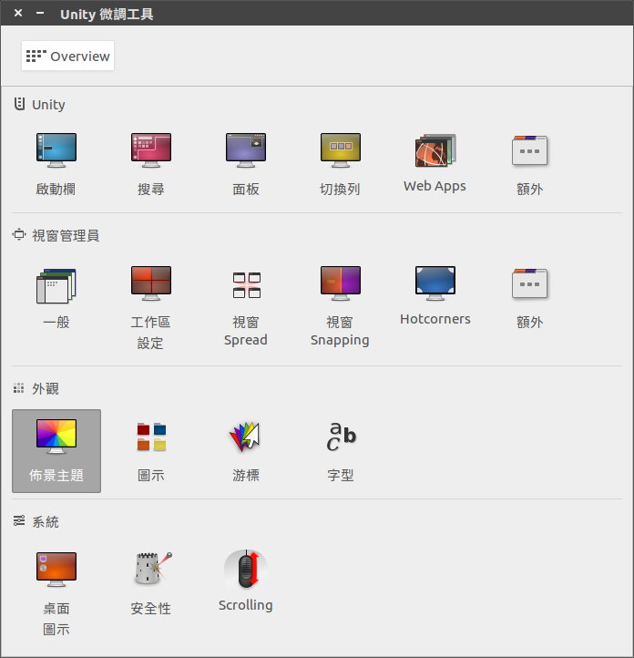
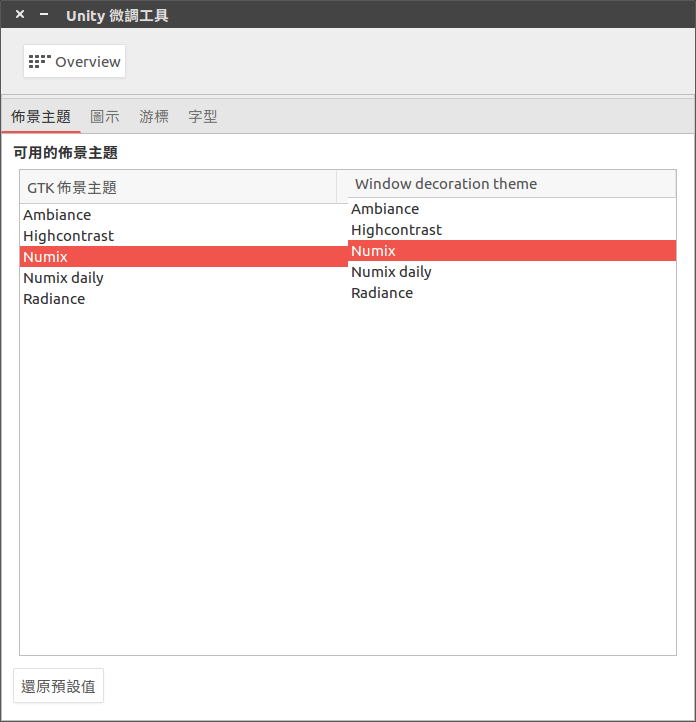
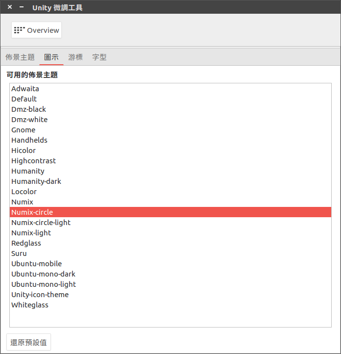

# Numix

新增 ppa 來源
```bash
$ sudo add-apt-repository ppa:numix/ppa
$ sudo apt update
$ sudo apt install numix-gtk-theme numix-icon-theme-circle
```

安裝 Unity 微調工具
```bash
$ sudo apt install unity-tweak-tool
$ unity-tweak-tool
```

修改主題





修改 ICON


